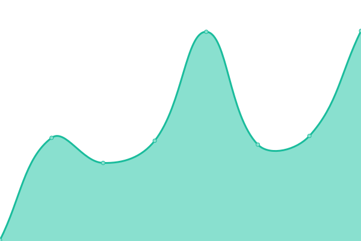

# [📈 Live Status](https://IDKHTS.github.io/upptime-demo): <!--live status--> **🟧 Partial outage**

This repository contains the open-source uptime monitor and status page for [IDKHTS](https://IDKHTS.github.io/upptime-demo), powered by [Upptime](https://github.com/upptime/upptime).

With [Upptime](https://upptime.js.org), you can get your own unlimited and free uptime monitor and status page, powered entirely by a GitHub repository. We use [Issues](https://github.com/IDKHTS/upptime-demo/issues) as incident reports, [Actions](https://github.com/IDKHTS/upptime-demo/actions) as uptime monitors, and [Pages](https://IDKHTS.github.io/upptime-demo) for the status page.

<!--start: status pages-->
<!-- This summary is generated by Upptime (https://github.com/upptime/upptime) -->
<!-- Do not edit this manually, your changes will be overwritten -->
<!-- prettier-ignore -->
| URL | Status | History | Response Time | Uptime |
| --- | ------ | ------- | ------------- | ------ |
|  [Org Home](https://snapmaker.com) | 🟩 Up | [org-home.yml](https://github.com/IDKHTS/upptime-demo/commits/HEAD/history/org-home.yml) | 

 367ms
     
 | 

<a href="https://IDKHTS.github.io/upptime-demo/history/org-home">100.00%</a>
    

|  [Support Home](https://support.snapmaker.com/hc/en-us) | 🟥 Down | [support-home.yml](https://github.com/IDKHTS/upptime-demo/commits/HEAD/history/support-home.yml) | 

 106ms
     
 | 

<a href="https://IDKHTS.github.io/upptime-demo/history/support-home">0.00%</a>
    

|  [CN Org Home](https://snapmaker.cn/) | 🟩 Up | [cn-org-home.yml](https://github.com/IDKHTS/upptime-demo/commits/HEAD/history/cn-org-home.yml) | 

 2319ms
     
 | 

<a href="https://IDKHTS.github.io/upptime-demo/history/cn-org-home">100.00%</a>
    

|  [Ohters Shopify](https://shop.snapmaker.com/) | 🟩 Up | [ohters-shopify.yml](https://github.com/IDKHTS/upptime-demo/commits/HEAD/history/ohters-shopify.yml) | 

 364ms
     
 | 

<a href="https://IDKHTS.github.io/upptime-demo/history/ohters-shopify">100.00%</a>
    

|  [EU Shopify](https://eu.snapmaker.com/) | 🟩 Up | [eu-shopify.yml](https://github.com/IDKHTS/upptime-demo/commits/HEAD/history/eu-shopify.yml) | 

 566ms
     
 | 

<a href="https://IDKHTS.github.io/upptime-demo/history/eu-shopify">100.00%</a>
    

|  [US Shopify](https://us.snapmaker.com/) | 🟩 Up | [us-shopify.yml](https://github.com/IDKHTS/upptime-demo/commits/HEAD/history/us-shopify.yml) | 

 626ms
     
 | 

<a href="https://IDKHTS.github.io/upptime-demo/history/us-shopify">100.00%</a>
    

|  [Org Artisan](https://snapmaker.com/snapmaker-artisan) | 🟩 Up | [org-artisan.yml](https://github.com/IDKHTS/upptime-demo/commits/HEAD/history/org-artisan.yml) | 

 345ms
     
 | 

<a href="https://IDKHTS.github.io/upptime-demo/history/org-artisan">100.00%</a>
    

|  [Org Snapmaker 2](https://snapmaker.com/snapmaker-2) | 🟩 Up | [org-snapmaker-2.yml](https://github.com/IDKHTS/upptime-demo/commits/HEAD/history/org-snapmaker-2.yml) | 

 199ms
     
 | 

<a href="https://IDKHTS.github.io/upptime-demo/history/org-snapmaker-2">100.00%</a>
    

|  [Org 10W Laser](https://snapmaker.com/snapmaker-10w-laser-module) | 🟩 Up | [org-10-w-laser.yml](https://github.com/IDKHTS/upptime-demo/commits/HEAD/history/org-10-w-laser.yml) | 

 176ms
     
 | 

<a href="https://IDKHTS.github.io/upptime-demo/history/org-10-w-laser">100.00%</a>
    

|  [Org Software](https://snapmaker.com/snapmaker-luban) | 🟩 Up | [org-software.yml](https://github.com/IDKHTS/upptime-demo/commits/HEAD/history/org-software.yml) | 

 147ms
     
 | 

<a href="https://IDKHTS.github.io/upptime-demo/history/org-software">100.00%</a>
    

|  [Org Materials](https://snapmaker.com/materials) | 🟩 Up | [org-materials.yml](https://github.com/IDKHTS/upptime-demo/commits/HEAD/history/org-materials.yml) | 

 158ms
     
 | 

<a href="https://IDKHTS.github.io/upptime-demo/history/org-materials">100.00%</a>
    

|  [Org Community](https://snapmaker.com/community) | 🟩 Up | [org-community.yml](https://github.com/IDKHTS/upptime-demo/commits/HEAD/history/org-community.yml) | 

 160ms
     
 | 

<a href="https://IDKHTS.github.io/upptime-demo/history/org-community">100.00%</a>
    

|  [Luban installer](https://api.snapmaker.com/luban-installers) | 🟩 Up | [luban-installer.yml](https://github.com/IDKHTS/upptime-demo/commits/HEAD/history/luban-installer.yml) | 

 148ms
     
 | 

<a href="https://IDKHTS.github.io/upptime-demo/history/luban-installer">100.00%</a>
    

<!--end: status pages-->

[**Visit our status website →**](https://IDKHTS.github.io/upptime-demo)

## 📄 License

- Powered by: [Upptime](https://github.com/upptime/upptime)
- Code: [MIT](./LICENSE) © [IDKHTS](https://IDKHTS.github.io/upptime-demo)
- Data in the `./history` directory: [Open Database License](https://opendatacommons.org/licenses/odbl/1-0/)
